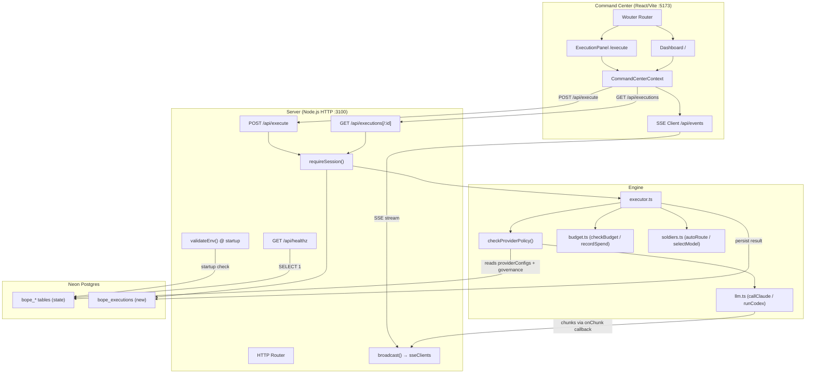
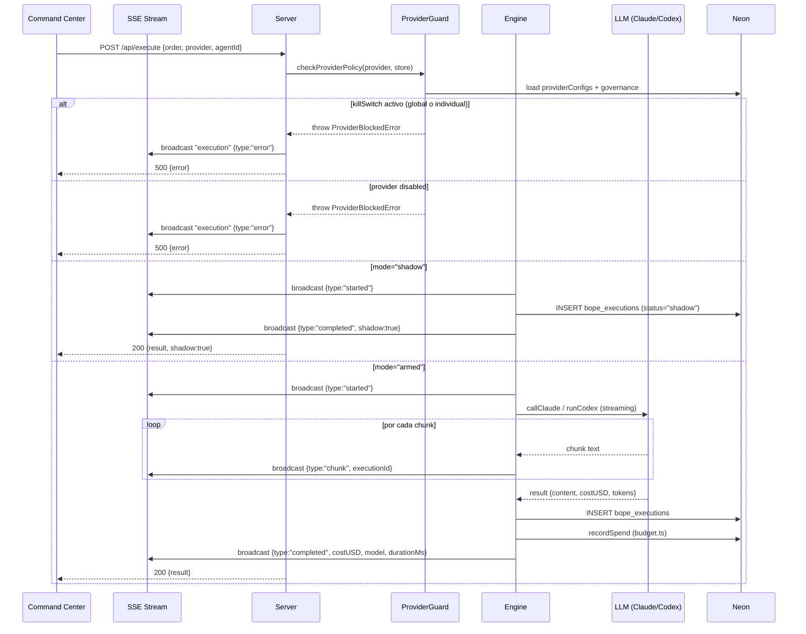

# Diseño Técnico — BOPE Completion

## Overview

Este documento describe el diseño técnico para completar la plataforma BOPE (Batallón de Operaciones de Precisión y Excelencia). El sistema ya tiene una base sólida: frontend React/Vite, backend Node.js nativo HTTP, persistencia en Postgres (Neon), autenticación JWT, SSE para eventos en tiempo real, y un motor de ejecución con routing automático de agentes.

Las siete áreas de trabajo cubren la brecha entre el estado actual y un sistema completamente funcional y operativo:

1. **Activación controlada de proveedores LLM** — integrar la lógica de `ProviderConfigRecord` (ya persistida en `bope_provider_configs`) con el motor de ejecución (`executor.ts`), que actualmente ignora el estado de gobernanza al llamar a `callClaude`/`runCodex`.
2. **Streaming real en la UI** — el servidor ya hace `broadcast("execution", event)` por SSE, pero el frontend acumula chunks sin lógica de agrupación por `executionId`.
3. **Panel de ejecución dedicado** — nueva ruta `/execute` con historial persistido, selección de agente/provider, y visualización de chunks en vivo.
4. **Persistencia de ejecuciones** — nueva tabla `bope_executions` en Neon, endpoints `GET /api/executions` y `GET /api/executions/:id`.
5. **Limpieza arquitectónica** — decisión sobre `app/` (Next.js legacy), documento `docs/PLATAFORMA-BOPE-vNEXT.md`, corrección de texto en Dashboard.
6. **Cobertura de tests** — suite de tests unitarios y de propiedad para `autoRouteSoldier`, `selectModel`, y `getBudgetSummary` usando Vitest + fast-check.
7. **Configuración de entorno y arranque** — validación de env vars al startup, endpoint `GET /api/healthz` con verificación real de Neon, `.env.example` completo.

### Decisión sobre `app/` (Next.js)

El directorio `app/` contiene una aplicación Next.js con Sentry, Drizzle ORM, y una estructura de base de datos separada. Coexiste con `apps/bope-command-center/` (React/Vite) sin integración. **Decisión: archivar**. Se moverá a `archive/app-nextjs-legacy/` y se excluirá de `pnpm-workspace.yaml`. El stack canónico es React/Vite + Node.js nativo HTTP.

---

## Architecture

El sistema sigue una arquitectura de tres capas con comunicación bidireccional vía HTTP REST y unidireccional vía SSE:



### Flujo de una ejecución completa



---

## Components and Interfaces

### 1. ProviderGuard (nuevo módulo en engine/)

Nuevo archivo `apps/bope-command-center-server/src/engine/providerGuard.ts`. Centraliza toda la lógica de gobernanza antes de que el executor llame al LLM.

```typescript
export class ProviderBlockedError extends Error {
  constructor(
    public readonly reason: "kill_switch" | "disabled" | "global_kill_switch" | "budget_exceeded",
    message: string
  ) {
    super(message);
    this.name = "ProviderBlockedError";
  }
}

export interface ProviderPolicy {
  config: ProviderConfigRecord;       // de bope_provider_configs
  governance: ProviderGovernanceRecord; // de bope_provider_governance
}

/**
 * Verifica que el provider puede ejecutar.
 * Lanza ProviderBlockedError si alguna condición lo bloquea.
 * Retorna el modo efectivo ("shadow" | "armed").
 */
export function assertProviderAllowed(
  policy: ProviderPolicy
): "shadow" | "armed"
```

El `executor.ts` se modifica para:
1. Recibir `ProviderPolicy` como parámetro adicional (o cargarlo desde el store).
2. Llamar a `assertProviderAllowed(policy)` antes de cualquier llamada LLM.
3. Si el modo es `"shadow"`, retornar una respuesta simulada sin llamar al LLM.

### 2. Execution Persistence (nuevo módulo en server/)

Nuevo archivo `apps/bope-command-center-server/src/executions.ts`:

```typescript
export interface ExecutionRecord {
  id: string;
  agentId: string;
  provider: "claude" | "codex";
  model: string;
  order: string;
  output: string;
  costUSD: number;
  inputTokens: number;
  outputTokens: number;
  durationMs: number;
  viaCliTool: boolean;
  status: "completed" | "failed" | "shadow";
  timestamp: string;
}

export async function persistExecution(record: ExecutionRecord): Promise<void>

export async function getExecutions(
  limit: number,
  offset: number
): Promise<{ rows: ExecutionRecord[]; total: number }>

export async function getExecutionById(id: string): Promise<ExecutionRecord | null>
```

### 3. ExecutionPanel (nuevo componente React)

Nueva página `apps/bope-command-center/src/pages/Execute.tsx`:

```typescript
interface ExecutionPanelProps {}

// Formulario de orden
interface OrderFormState {
  order: string;
  provider: "auto" | "claude" | "codex";
  agentId: string | null;
}

// Entrada del historial de sesión
interface SessionExecution {
  id: string;
  agentId: string;
  provider: string;
  model: string;
  costUSD: number;
  durationMs: number;
  output: string;
  timestamp: string;
  status: "completed" | "failed" | "shadow";
}
```

El panel tiene tres zonas:
- **Formulario** (izquierda superior): campo de orden, selector de provider, selector de agente opcional, botón EJECUTAR.
- **Consola en vivo** (centro): muestra chunks del `executionLog` filtrados por `executionId` activo, con acumulación progresiva.
- **Historial** (derecha): lista de ejecuciones de la sesión + historial persistido de `GET /api/executions`. Al seleccionar una, muestra el output completo en un panel de detalle.

### 4. Healthz Endpoint (modificación en server.ts)

El endpoint existente `GET /api/healthz` actualmente retorna `{ ok: true, service: "..." }` sin verificar la DB. Se modifica para:

```typescript
// GET /api/healthz
// Response: { ok: boolean, db: "connected" | "error", version: string }
```

La verificación de DB ejecuta `SELECT 1` con timeout de 3 segundos. Si falla, retorna `db: "error"` con HTTP 200 (el endpoint siempre responde, el cliente interpreta el campo `db`).

### 5. Env Validator (nuevo módulo en server/)

Nuevo archivo `apps/bope-command-center-server/src/envValidator.ts`:

```typescript
const REQUIRED_VARS = [
  "BOPE_COMMAND_CENTER_DATABASE_URL",
  "JWT_SECRET",
] as const;

/**
 * Valida que las variables de entorno críticas estén presentes.
 * Lanza un error descriptivo y termina el proceso si alguna falta.
 * Se llama al inicio de server.ts antes de inicializar la DB.
 */
export function validateEnv(): void
```

### 6. Test Suite (nuevo paquete)

Nueva carpeta `apps/bope-command-center-server/src/__tests__/` con:

- `soldiers.test.ts` — tests unitarios y de propiedad para `autoRouteSoldier` y `selectModel`
- `budget.test.ts` — tests unitarios y de propiedad para `getBudgetSummary`

Dependencias de test a agregar al `package.json` del server:
- `vitest` — test runner
- `fast-check` — property-based testing library

Script a agregar en el `package.json` raíz:
```json
"test": "pnpm --dir apps/bope-command-center-server exec vitest run"
```

---

## Data Models

### Nueva tabla: `bope_executions`

Migración `0004_executions.sql`:

```sql
CREATE TABLE IF NOT EXISTS bope_executions (
  id          text PRIMARY KEY,
  agent_id    text NOT NULL,
  provider    text NOT NULL,           -- 'claude' | 'codex'
  model       text NOT NULL,
  "order"     text NOT NULL,
  output      text NOT NULL,
  cost_usd    double precision NOT NULL DEFAULT 0,
  input_tokens  integer NOT NULL DEFAULT 0,
  output_tokens integer NOT NULL DEFAULT 0,
  duration_ms   integer NOT NULL DEFAULT 0,
  via_cli_tool  boolean NOT NULL DEFAULT false,
  status      text NOT NULL DEFAULT 'completed', -- 'completed' | 'failed' | 'shadow'
  created_at  timestamptz NOT NULL DEFAULT now()
);

CREATE INDEX IF NOT EXISTS idx_bope_executions_created_at
  ON bope_executions(created_at DESC);
```

### Modificación: `bope_provider_configs`

No se requiere migración adicional. La tabla ya tiene todos los campos necesarios (`mode`, `enabled`, `kill_switch_active`). La integración es a nivel de código: el executor debe leer estos valores antes de llamar al LLM.

### Contrato de eventos SSE

Todos los eventos SSE de ejecución tienen el tipo `"execution"` y el siguiente shape:

```typescript
interface ExecutionSSEEvent {
  id: string;           // UUID del evento
  executionId: string;  // UUID de la ejecución (agrupa chunks)
  type: "started" | "chunk" | "completed" | "error" | "budget_warning";
  provider?: "claude" | "codex";
  message: string;      // texto del chunk o mensaje de estado
  timestamp: string;    // ISO 8601
  costUSD?: number;     // solo en "completed"
  model?: string;       // solo en "completed"
  durationMs?: number;  // solo en "completed"
}
```

### Variables de entorno

Todas las variables documentadas en `.env.example`:

| Variable | Requerida | Descripción |
|---|---|---|
| `BOPE_COMMAND_CENTER_DATABASE_URL` | ✅ | Connection string de Neon |
| `JWT_SECRET` | ✅ | Secreto para firmar JWTs |
| `BOPE_COMMAND_CENTER_DATABASE_SSL` | ❌ | `true` para SSL (Neon en producción) |
| `BOPE_COMMAND_CENTER_SERVER_PORT` | ❌ | Puerto del servidor (default: 3100) |
| `BOPE_DISABLE_API` | ❌ | `true` para bloquear fallback a API paga |
| `BOPE_PREFER_API` | ❌ | `true` para preferir API sobre CLI |
| `ANTHROPIC_API_KEY` | ❌ | API key de Anthropic (fallback cuando CLI no disponible) |
| `OPENAI_API_KEY` | ❌ | API key de OpenAI (fallback cuando CLI no disponible) |
| `BOPE_ANNUAL_BUDGET` | ❌ | Límite anual en USD (default: 1500) |
| `BOPE_MONTHLY_LIMIT` | ❌ | Límite mensual en USD (default: 125) |
| `BOPE_MAX_EXECUTION_COST` | ❌ | Límite por ejecución en USD (default: 2.0) |
| `BOPE_ALLOWED_ORIGIN` | ❌ | Origen CORS adicional permitido |
| `NODE_ENV` | ❌ | `production` activa Secure flag en cookies |

---

## Correctness Properties

*Una propiedad es una característica o comportamiento que debe ser verdadero en todas las ejecuciones válidas del sistema — esencialmente, una declaración formal sobre lo que el software debe hacer. Las propiedades sirven como puente entre especificaciones legibles por humanos y garantías de corrección verificables automáticamente.*

### Property 1: autoRouteSoldier siempre retorna un agentId válido

*Para cualquier* string de orden (incluyendo strings vacíos, con caracteres especiales, o muy largos), `autoRouteSoldier` debe retornar un `agentId` que sea un string no vacío y no `undefined`.

**Validates: Requirements 6.3**

### Property 2: selectModel siempre retorna exactamente uno de los dos modelos válidos

*Para cualquier* combinación de string de orden y string de agentId, `selectModel` debe retornar exactamente `"claude-haiku-4-5-20251001"` o `"claude-sonnet-4-6"`, nunca otro valor.

**Validates: Requirements 6.4**

### Property 3: Invariante de conservación del presupuesto

*Para cualquier* `BudgetState` válido (con `annualSpent >= 0` y `annualLimit > 0`), `getBudgetSummary` debe satisfacer: `annualRemaining + annualSpent === annualLimit`.

**Validates: Requirements 6.6**

### Property 4: checkBudget rechaza cuando el gasto supera el límite

*Para cualquier* `BudgetState` donde `annualSpent >= annualLimit` o `monthlySpent >= monthlyLimit`, `checkBudget` debe lanzar `BudgetExceededError`.

**Validates: Requirements 1.7**

### Property 5: assertProviderAllowed bloquea cuando killSwitch está activo

*Para cualquier* `ProviderPolicy` donde `config.killSwitchActive === true` o `governance.globalKillSwitchActive === true`, `assertProviderAllowed` debe lanzar `ProviderBlockedError`.

**Validates: Requirements 1.2, 1.6**

### Property 6: assertProviderAllowed bloquea cuando el provider está deshabilitado

*Para cualquier* `ProviderPolicy` donde `config.enabled === false` (y `killSwitchActive === false`), `assertProviderAllowed` debe lanzar `ProviderBlockedError`.

**Validates: Requirements 1.3**

### Property 7: El executionLog nunca supera 500 entradas

*Para cualquier* secuencia de N eventos SSE de tipo `"execution"` (con N > 500), después de procesar todos los eventos, `executionLog.length` debe ser `<= 500`.

**Validates: Requirements 2.5, 2.6**

### Property 8: Los endpoints de /api/executions requieren autenticación

*Para cualquier* request a `GET /api/executions` o `GET /api/executions/:id` sin un token de sesión válido, el servidor debe retornar HTTP 401.

**Validates: Requirements 4.5**

### Property 9: GET /api/executions retorna resultados ordenados por timestamp descendente

*Para cualquier* conjunto de N ejecuciones insertadas con timestamps distintos, `GET /api/executions` debe retornar los registros en orden descendente por `created_at` (el más reciente primero).

**Validates: Requirements 4.2**

### Property 10: Advertencia visual cuando el provider está bloqueado

*Para cualquier* configuración de provider donde `killSwitchActive === true` o `enabled === false`, el componente `ExecutionPanel` debe renderizar un elemento de advertencia visible.

**Validates: Requirements 3.7**

---

## Error Handling

### Jerarquía de errores del Engine

```
Error
├── ProviderBlockedError (reason: "kill_switch" | "disabled" | "global_kill_switch" | "budget_exceeded")
├── BudgetExceededError (ya existe en budget.ts)
└── LLMCallError (wraps errores de CLI/API)
```

### Estrategia de manejo por capa

**Engine (executor.ts)**:
- `ProviderBlockedError` → emite evento SSE `type:"error"` con mensaje descriptivo, re-lanza para que el servidor retorne 500.
- `BudgetExceededError` → mismo tratamiento que `ProviderBlockedError`.
- Errores de CLI/API → emite evento SSE `type:"error"`, re-lanza.
- En todos los casos de error, el executor intenta persistir el registro en `bope_executions` con `status="failed"` y el mensaje de error en `output`.

**Server (server.ts)**:
- Errores del executor → HTTP 500 con `{ error: message }`.
- Requests sin autenticación → HTTP 401.
- Requests con body inválido → HTTP 400.

**Frontend (ExecutionPanel)**:
- Errores de `executeOrder` → mostrar mensaje de error inline en el formulario.
- Eventos SSE `type:"error"` → mostrar en la consola en vivo con estilo de error (texto rojo).
- `GET /api/healthz` con `db:"error"` → banner de error persistente en la parte superior del layout.

### Timeouts y resiliencia

- LLM CLI: timeout de 120 segundos (ya implementado en `llm.ts`).
- LLM API: timeout de 120 segundos con `AbortController` (ya implementado).
- Healthz DB check: timeout de 3 segundos para no bloquear el startup.
- SSE keep-alive: ping cada 20 segundos (ya implementado).

---

## Testing Strategy

### Herramientas

- **Test runner**: [Vitest](https://vitest.dev/) — compatible con ESM, TypeScript nativo, sin configuración extra para el stack existente.
- **Property-based testing**: [fast-check](https://fast-check.dev/) — librería madura para PBT en TypeScript/JavaScript.
- **Mocking**: `vi.mock()` de Vitest para aislar dependencias externas (DB, LLM CLI/API).

### Configuración

Agregar a `apps/bope-command-center-server/package.json`:

```json
{
  "scripts": {
    "test": "vitest run"
  },
  "devDependencies": {
    "vitest": "^2.0.0",
    "fast-check": "^3.22.0"
  }
}
```

Agregar al `package.json` raíz:

```json
{
  "scripts": {
    "test": "pnpm --dir apps/bope-command-center-server run test"
  }
}
```

### Tests unitarios (ejemplo-based)

**`soldiers.test.ts`**:
- Cada agente en `SONNET_FORCE` → `selectModel` retorna `"claude-sonnet-4-6"`.
- Cada agente en `HAIKU_FORCE` → `selectModel` retorna `"claude-haiku-4-5-20251001"`.
- Orden corta sin keywords complejas → haiku.
- Orden larga (>50 palabras) → sonnet.
- Orden con keyword compleja ("implementá") → sonnet.
- Cada keyword de cada regla de routing → `autoRouteSoldier` retorna el agentId esperado.
- Orden sin keywords → `autoRouteSoldier` retorna `"john-rambo"`.

**`budget.test.ts`**:
- `annualSpent = 0` → status `"ok"`.
- `annualSpent = 74% de annualLimit` → status `"ok"`.
- `annualSpent = 75% de annualLimit` → status `"warning"`.
- `annualSpent = 89% de annualLimit` → status `"warning"`.
- `annualSpent = 90% de annualLimit` → status `"critical"`.
- `annualSpent = 100% de annualLimit` → status `"critical"`.

### Tests de propiedad (property-based)

Cada test de propiedad se ejecuta con mínimo **100 iteraciones** (configuración por defecto de fast-check).

**`soldiers.test.ts` — propiedades**:

```typescript
// Feature: bope-completion, Property 1: autoRouteSoldier siempre retorna un agentId válido
it("autoRouteSoldier: para cualquier string retorna agentId válido", () => {
  fc.assert(
    fc.property(fc.string(), (order) => {
      const result = autoRouteSoldier(order);
      expect(typeof result).toBe("string");
      expect(result.length).toBeGreaterThan(0);
    })
  );
});

// Feature: bope-completion, Property 2: selectModel siempre retorna uno de los dos modelos válidos
it("selectModel: para cualquier (order, agentId) retorna modelo válido", () => {
  const VALID_MODELS = ["claude-haiku-4-5-20251001", "claude-sonnet-4-6"];
  fc.assert(
    fc.property(fc.string(), fc.string(), (order, agentId) => {
      const result = selectModel(order, agentId);
      expect(VALID_MODELS).toContain(result);
    })
  );
});
```

**`budget.test.ts` — propiedades**:

```typescript
// Feature: bope-completion, Property 3: invariante de conservación del presupuesto
it("getBudgetSummary: annualRemaining + annualSpent === annualLimit", () => {
  fc.assert(
    fc.property(
      fc.record({
        annualLimit: fc.float({ min: 1, max: 10000, noNaN: true }),
        annualSpent: fc.float({ min: 0, max: 10000, noNaN: true }),
        monthlyLimit: fc.float({ min: 1, max: 1000, noNaN: true }),
        monthlySpent: fc.float({ min: 0, max: 1000, noNaN: true }),
        currentMonthKey: fc.constant("2025-01"),
        byProvider: fc.constant({}),
        tokensByProvider: fc.constant({}),
        executionCount: fc.nat(),
        lastUpdated: fc.constant(new Date().toISOString()),
      }),
      (state) => {
        const summary = getBudgetSummary(state);
        expect(summary.annualRemaining + summary.annualSpent).toBeCloseTo(summary.annualLimit, 10);
      }
    )
  );
});

// Feature: bope-completion, Property 4: checkBudget rechaza cuando el gasto supera el límite
it("checkBudget: lanza BudgetExceededError cuando annualSpent >= annualLimit", () => {
  fc.assert(
    fc.property(
      fc.float({ min: 1, max: 10000, noNaN: true }),
      async (limit) => {
        const state: BudgetState = { ...emptyState(), annualLimit: limit, annualSpent: limit };
        // mock readBudget to return this state
        await expect(checkBudget(0)).rejects.toBeInstanceOf(BudgetExceededError);
      }
    )
  );
});
```

### Dual testing approach

- **Tests unitarios**: cubren ejemplos concretos, casos límite, y condiciones de error específicas.
- **Tests de propiedad**: verifican invariantes universales que deben sostenerse para cualquier input válido.
- Los tests de propiedad no reemplazan los unitarios — son complementarios. Los unitarios documentan el comportamiento esperado en casos concretos; los de propiedad garantizan que no hay regresiones en el espacio de inputs.

### Ejecución sin dependencias externas

Los tests deben ejecutarse sin conexión a Neon ni variables de entorno externas. Las funciones `autoRouteSoldier`, `selectModel`, y `getBudgetSummary` son puras (no tienen efectos secundarios ni dependencias de I/O), por lo que no requieren mocking. Para `checkBudget`, se mockea `readBudget` con `vi.mock`.
